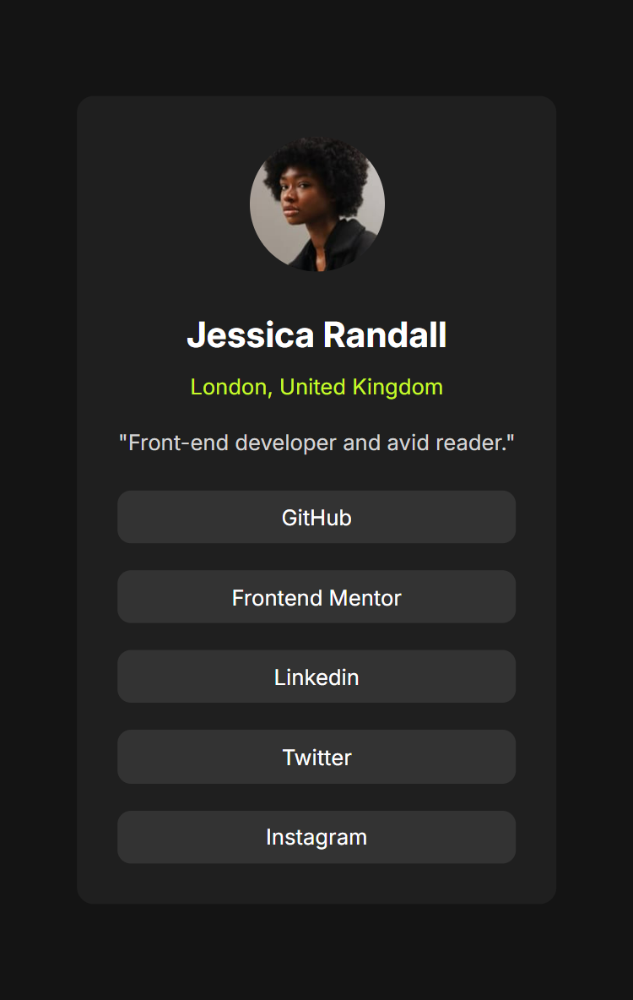

# Frontend Mentor - Social Links Profile

This is a solution to the [Frontend Mentor - Social Links Profile challenge](https://www.frontendmentor.io/challenges/social-links-profile-UG32l9m6dQ).

🔗 [Live Site](https://yourusername.github.io/social-links-profile/)

## Overview

### The Challenge

Build out a profile card component and get it looking as close to the design as possible.

Users should be able to:
- View the social profile component
- Hover over the social links to see a hover effect

### Screenshot

## My Process

### Built With

- Semantic HTML5
- CSS3
- Flexbox
- Mobile-first workflow
- Google Fonts (Inter)

### What I Learned

- How to structure semantic profile cards using HTML
- How to style social links with `flex-direction: column`
- How to target nested elements (`li a`) for hover effects
- How to apply custom hover effects for both background and text color in a clean way

### Continued Development

Next time, I might:
- Make it responsive for larger screens using media queries

## Author

- Frontend Mentor – [@TelmoManduco](https://www.frontendmentor.io/profile/TelmoManduco)
- GitHub – [@TelmoManduco](https://github.com/TelmoManduco)

